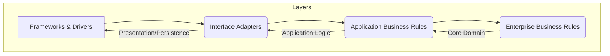

# Visão Geral da Arquitetura Limpa

A Arquitetura Limpa organiza o software em camadas concêntricas, onde as dependências fluem apenas para dentro. As camadas internas (Domínio e Aplicação) contêm a lógica de negócio principal e são independentes de frameworks, bancos de dados ou interfaces de usuário. As camadas externas (Infraestrutura e Apresentação) são responsáveis por detalhes de implementação e dependem das camadas internas.

