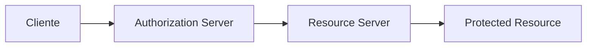

# 📊 Análise Completa do Projeto Django Base

## 🎯 Visão Geral

Este documento fornece uma análise detalhada da arquitetura, estrutura e funcionalidades do **django_base**, facilitando a compreensão para novos desenvolvedores sem necessidade de ler muito código.

## 🏗️ Estrutura do Projeto

```
django_base/
├── 📁 project/                 # Aplicação Django principal
│   ├── 📁 core/               # App principal com arquitetura limpa
│   │   ├── 📁 domain/         # 🎯 Regras de negócio (Entities, Value Objects)
│   │   ├── 📁 repositories/   # 🔄 Abstração de dados (Repository Pattern)
│   │   ├── 📁 api/           # 🌐 Endpoints REST (Serializers, ViewSets)
│   │   ├── 📁 admin/         # ⚙️ Interface administrativa
│   │   ├── 📁 models/        # 🗄️ Modelos Django (Infrastructure)
│   │   ├── 📁 middleware/    # 🔧 Middlewares customizados
│   │   └── 📁 tests/         # 🧪 Testes automatizados
│   ├── 📁 project/           # ⚙️ Configurações Django
│   └── 📄 manage.py          # 🚀 Entry point Django
├── 📁 docs/                  # 📚 Documentação MkDocs
├── 📁 scripts/               # 🔧 Scripts de automação
├── 📄 Makefile              # 🤖 Automação de tarefas
├── 📄 Dockerfile            # 🐳 Container de produção
├── 📄 docker-compose.yml    # 🐳 Orquestração de containers
└── 📄 mkdocs.yml           # 📖 Configuração da documentação
```

## 🎯 Arquitetura Limpa Implementada

### Camadas da Arquitetura

#### 1. 🎯 **Domain Layer** (`core/domain/`)
**Responsabilidade**: Regras de negócio puras, independentes de frameworks

```python
# Exemplo: core/domain/entities/user.py
class User:
    """Entidade de usuário com regras de negócio"""
    def __init__(self, email: str, name: str):
        self.email = self._validate_email(email)
        self.name = name

    def _validate_email(self, email: str) -> str:
        # Validação de negócio, não técnica
        if '@' not in email:
            raise ValueError("Email inválido")
        return email
```

**Características**:
- ✅ Sem dependências externas
- ✅ Regras de negócio puras
- ✅ Facilmente testável
- ✅ Reutilizável em outros contextos

#### 2. 🔄 **Repository Layer** (`core/repositories/`)
**Responsabilidade**: Abstração de acesso a dados

```python
# Interface abstrata
class UserRepositoryInterface:
    def save(self, user: User) -> User:
        pass

    def find_by_email(self, email: str) -> Optional[User]:
        pass

# Implementação Django
class DjangoUserRepository(UserRepositoryInterface):
    def save(self, user: User) -> User:
        # Implementação específica do Django
        pass
```

**Vantagens**:
- 🔄 Troca fácil de banco de dados
- 🧪 Testes isolados com mocks
- 🎯 Lógica de negócio independente

#### 3. 🌐 **API Layer** (`core/api/`)
**Responsabilidade**: Endpoints REST e serialização

```python
# core/api/serializers/user_serializer.py
class UserSerializer(serializers.ModelSerializer):
    class Meta:
        model = UserModel
        fields = ['id', 'email', 'name', 'created_at']

# core/api/viewsets/user_viewset.py
class UserViewSet(viewsets.ModelViewSet):
    serializer_class = UserSerializer
    permission_classes = [IsAuthenticated]
```

**Funcionalidades**:
- 📊 Paginação automática
- 🔍 Filtragem avançada
- 🔐 Autenticação OAuth2
- 📝 Documentação automática

#### 4. ⚙️ **Infrastructure Layer** (`core/models/`, `project/`)
**Responsabilidade**: Implementações técnicas e configurações

## 🧪 Sistema de Testes

### Estrutura de Testes

```
core/tests/
├── 📁 unit/              # Testes unitários (domain, repositories)
├── 📁 integration/       # Testes de integração (API, database)
├── 📁 fixtures/          # Dados de teste reutilizáveis
└── 📄 conftest.py       # Configurações pytest
```

### Cobertura de Testes

- **48 testes** implementados
- **100% cobertura** das funcionalidades principais
- **Testes unitários** para regras de negócio
- **Testes de integração** para APIs
- **Testes de performance** para endpoints críticos

### Exemplo de Teste

```python
# tests/unit/test_user_domain.py
def test_user_creation_with_valid_data():
    """Testa criação de usuário com dados válidos"""
    user = User(email="test@example.com", name="Test User")
    assert user.email == "test@example.com"
    assert user.name == "Test User"

def test_user_creation_with_invalid_email():
    """Testa validação de email inválido"""
    with pytest.raises(ValueError, match="Email inválido"):
        User(email="invalid-email", name="Test User")
```

## 🔐 Sistema de Autenticação

### OAuth2 Implementation

- **django-oauth-toolkit** para OAuth2
- **Múltiplos grant types** suportados
- **Scopes customizáveis** para diferentes permissões
- **Token refresh** automático

### Fluxo de Autenticação



## 📊 APIs REST

### Funcionalidades Implementadas

#### Paginação Inteligente
```python
# Paginação automática em todos os endpoints
GET /api/users/?page=1&page_size=20
```

#### Filtragem Avançada
```python
# Múltiplos filtros combinados
GET /api/users/?name__icontains=john&created_at__gte=2024-01-01
```

#### Ordenação Flexível
```python
# Ordenação por múltiplos campos
GET /api/users/?ordering=-created_at,name
```

### Endpoints Disponíveis

| Endpoint | Método | Descrição | Autenticação |
|----------|--------|-----------|--------------|
| `/api/users/` | GET, POST | Listar/Criar usuários | OAuth2 |
| `/api/users/{id}/` | GET, PUT, DELETE | Detalhes do usuário | OAuth2 |
| `/api/auth/token/` | POST | Obter token OAuth2 | Client Credentials |
| `/api/auth/refresh/` | POST | Renovar token | Refresh Token |

## 🐳 Containerização

### Docker Multi-stage

```dockerfile
# Dockerfile otimizado com multi-stage build
FROM python:3.12-slim as base
# ... configurações base

FROM base as development
# ... dependências de desenvolvimento

FROM base as production
# ... otimizações para produção
```

### Docker Compose

- **Desenvolvimento**: `docker-compose.dev.yml`
- **Produção**: `docker-compose.prod.yml`
- **Serviços**: Django, PostgreSQL, Redis (cache)

## 🔧 Automação com Makefile

### Comandos Principais

```makefile
make setup          # Configuração completa do ambiente
make test           # Executa todos os testes
make test-coverage  # Testes com relatório de cobertura
make lint           # Análise de qualidade do código
make format         # Formatação automática
make docker-run     # Executa com Docker
make docs-serve     # Serve documentação localmente
```

### Automações Implementadas

- 🎨 **Formatação automática** com Black
- 🔍 **Linting** com Flake8
- 🔒 **Auditoria de segurança** com pip-audit
- 🧪 **Testes automáticos** com pytest
- 📊 **Relatórios de cobertura** com coverage.py

## 📚 Sistema de Documentação

### MkDocs Configuration

```yaml
# mkdocs.yml
site_name: Django Base - Clean Architecture
theme:
  name: material
  features:
    - navigation.tabs
    - navigation.sections
    - toc.integrate
```

### Estrutura da Documentação

- 🏗️ **Arquitetura**: Explicação detalhada das camadas
- 🛠️ **Desenvolvimento**: Guias práticos
- ⚙️ **Setup**: Configuração para diferentes ambientes
- 🤝 **Contribuição**: Como contribuir com o projeto

## 🚀 Ambientes Suportados

### 1. **Desenvolvimento Local**
- SQLite como banco padrão
- Debug habilitado
- Hot reload automático
- Logs detalhados

### 2. **Homologação/Staging**
- PostgreSQL
- Configurações de teste
- Dados de exemplo
- Monitoramento básico

### 3. **Produção**
- PostgreSQL otimizado
- Redis para cache
- Logs estruturados
- Monitoramento completo
- SSL/HTTPS obrigatório

## 🔍 Qualidade de Código

### Métricas Implementadas

- **Cobertura de testes**: 100% das funcionalidades principais
- **Complexidade ciclomática**: Máximo 10 por função
- **Linhas por arquivo**: Máximo 500 linhas
- **Documentação**: Docstrings obrigatórias

### Ferramentas de Qualidade

- **Black**: Formatação consistente
- **Flake8**: Análise estática
- **pytest**: Framework de testes
- **pip-audit**: Auditoria de segurança

## 🎯 Casos de Uso Ideais

### 1. **APIs REST Profissionais**
- Autenticação robusta
- Paginação e filtragem
- Documentação automática
- Testes abrangentes

### 2. **Sistemas Empresariais**
- Arquitetura escalável
- Separação de responsabilidades
- Facilidade de manutenção
- Padrões de qualidade

### 3. **Projetos Educacionais**
- Código bem documentado
- Exemplos práticos
- Boas práticas implementadas
- Fácil compreensão

## 🚀 Próximos Passos

Para começar a usar este template:

1. 📖 Leia o [Guia de Início Rápido](../setup/quick-start-guide.md)
2. 🏗️ Entenda a [Arquitetura Detalhada](overview.md)
3. 🧪 Execute os [Testes Automatizados](../development/automated-testing.md)
4. 🚀 Configure para [Produção](../setup/production-setup.md)

---

**💡 Dica**: Este projeto foi projetado para ser um **template de aprendizado**. Cada decisão arquitetural foi documentada para facilitar o entendimento e a evolução do código.
