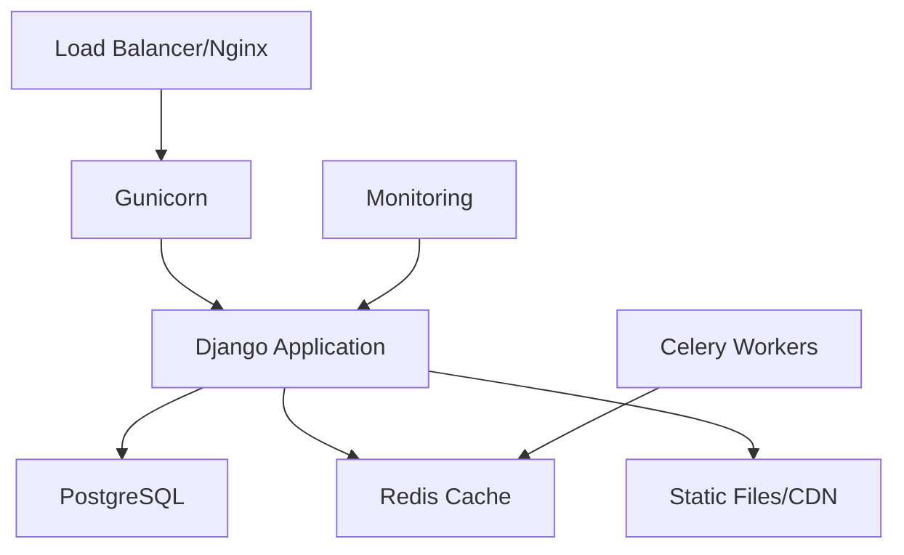

# 🚀 Guia Completo de Deploy em Produção

Este guia abrangente cobre todos os aspectos do deploy do Django Base em produção, desde a configuração inicial até monitoramento e manutenção.

## 📋 Pré-requisitos de Produção

### Servidor
- **Ubuntu 20.04+ / CentOS 8+** (recomendado)
- **4GB RAM mínimo** (8GB+ recomendado)
- **20GB+ de armazenamento SSD**
- **Acesso root ou sudo**

### Domínio e SSL
- **Domínio próprio** configurado
- **Certificado SSL** (Let's Encrypt gratuito)

### Serviços Externos
- **PostgreSQL 13+** (banco de dados)
- **Redis 6+** (cache e sessões)
- **SMTP** (envio de emails)

## 🏗️ Arquitetura de Produção



## 🐳 Deploy com Docker (Recomendado)

### 1. Preparação do Servidor

```bash
# Atualizar sistema
sudo apt update && sudo apt upgrade -y

# Instalar Docker
curl -fsSL https://get.docker.com -o get-docker.sh
sudo sh get-docker.sh
sudo usermod -aG docker $USER

# Instalar Docker Compose
sudo curl -L "https://github.com/docker/compose/releases/latest/download/docker-compose-$(uname -s)-$(uname -m)" -o /usr/local/bin/docker-compose
sudo chmod +x /usr/local/bin/docker-compose

# Reiniciar sessão para aplicar mudanças
exit
```

### 2. Configuração do Projeto

```bash
# Clone do projeto
git clone https://github.com/seu-usuario/seu-projeto.git
cd seu-projeto

# Criar arquivo de produção
cp dotenv_files/.env-example .env.prod
```

### 3. Configurar Variáveis de Ambiente

```bash
# .env.prod
DEBUG=False
SECRET_KEY=sua-chave-secreta-super-segura-aqui
ALLOWED_HOSTS=seudominio.com,www.seudominio.com
DATABASE_URL=postgresql://usuario:senha@db:5432/nome_db
REDIS_URL=redis://redis:6379/0
EMAIL_HOST=smtp.gmail.com
EMAIL_PORT=587
EMAIL_HOST_USER=seu-email@gmail.com
EMAIL_HOST_PASSWORD=sua-senha-app
EMAIL_USE_TLS=True
```

### 4. Deploy com Docker Compose

```bash
# Iniciar serviços de produção
make docker-prod

# Ou manualmente:
docker-compose -f docker-compose.prod.yml up -d --build
```

### 5. Configurações Pós-Deploy

```bash
# Executar migrações
docker-compose -f docker-compose.prod.yml exec web python manage.py migrate

# Criar superusuário
docker-compose -f docker-compose.prod.yml exec web python manage.py createsuperuser

# Coletar arquivos estáticos
docker-compose -f docker-compose.prod.yml exec web python manage.py collectstatic --noinput
```

## ⚙️ Deploy Manual (Alternativo)

### 1. Preparação do Sistema

```bash
# Instalar dependências do sistema
sudo apt update
sudo apt install -y python3.12 python3.12-venv python3-pip nginx postgresql postgresql-contrib redis-server

# Criar usuário para aplicação
sudo adduser django
sudo usermod -aG sudo django
```

### 2. Configuração do PostgreSQL

```bash
# Conectar ao PostgreSQL
sudo -u postgres psql

-- Criar banco e usuário
CREATE DATABASE django_prod;
CREATE USER django_user WITH PASSWORD 'senha_super_segura';
ALTER ROLE django_user SET client_encoding TO 'utf8';
ALTER ROLE django_user SET default_transaction_isolation TO 'read committed';
ALTER ROLE django_user SET timezone TO 'UTC';
GRANT ALL PRIVILEGES ON DATABASE django_prod TO django_user;
\q
```

### 3. Configuração da Aplicação

```bash
# Mudar para usuário django
sudo su - django

# Clone e configuração
git clone https://github.com/seu-usuario/seu-projeto.git
cd seu-projeto

# Ambiente virtual
python3.12 -m venv venv
source venv/bin/activate

# Instalar dependências
pip install -r project/requirements.txt
pip install gunicorn psycopg2-binary

# Configurar ambiente
cp dotenv_files/.env-example .env
# Editar .env com configurações de produção
```

### 4. Configuração do Gunicorn

```bash
# Criar arquivo de configuração
cat > gunicorn.conf.py << EOF
bind = "127.0.0.1:8000"
workers = 3
worker_class = "sync"
worker_connections = 1000
max_requests = 1000
max_requests_jitter = 100
timeout = 30
keepalive = 5
preload_app = True
EOF
```

### 5. Configuração do Systemd

```bash
# Criar service file
sudo tee /etc/systemd/system/django.service << EOF
[Unit]
Description=Django Gunicorn daemon
After=network.target

[Service]
User=django
Group=www-data
WorkingDirectory=/home/django/seu-projeto/project
ExecStart=/home/django/seu-projeto/venv/bin/gunicorn --config /home/django/seu-projeto/gunicorn.conf.py project.wsgi:application
ExecReload=/bin/kill -s HUP \$MAINPID
Restart=always

[Install]
WantedBy=multi-user.target
EOF

# Habilitar e iniciar serviço
sudo systemctl daemon-reload
sudo systemctl enable django
sudo systemctl start django
```

### 6. Configuração do Nginx

```bash
# Criar configuração do site
sudo tee /etc/nginx/sites-available/django << EOF
server {
    listen 80;
    server_name seudominio.com www.seudominio.com;

    location = /favicon.ico { access_log off; log_not_found off; }

    location /static/ {
        root /home/django/seu-projeto/project;
        expires 30d;
        add_header Cache-Control "public, immutable";
    }

    location /media/ {
        root /home/django/seu-projeto/project;
        expires 30d;
        add_header Cache-Control "public, immutable";
    }

    location / {
        include proxy_params;
        proxy_pass http://127.0.0.1:8000;
        proxy_set_header Host \$host;
        proxy_set_header X-Real-IP \$remote_addr;
        proxy_set_header X-Forwarded-For \$proxy_add_x_forwarded_for;
        proxy_set_header X-Forwarded-Proto \$scheme;
    }
}
EOF

# Habilitar site
sudo ln -s /etc/nginx/sites-available/django /etc/nginx/sites-enabled/
sudo nginx -t
sudo systemctl restart nginx
```

## 🔒 Configuração SSL com Let's Encrypt

```bash
# Instalar Certbot
sudo apt install certbot python3-certbot-nginx

# Obter certificado SSL
sudo certbot --nginx -d seudominio.com -d www.seudominio.com

# Testar renovação automática
sudo certbot renew --dry-run
```

## 📊 Monitoramento e Logs

### 1. Configuração de Logs

```python
# project/settings/production.py
LOGGING = {
    'version': 1,
    'disable_existing_loggers': False,
    'formatters': {
        'verbose': {
            'format': '{levelname} {asctime} {module} {process:d} {thread:d} {message}',
            'style': '{',
        },
    },
    'handlers': {
        'file': {
            'level': 'INFO',
            'class': 'logging.handlers.RotatingFileHandler',
            'filename': '/var/log/django/django.log',
            'maxBytes': 1024*1024*10,  # 10MB
            'backupCount': 5,
            'formatter': 'verbose',
        },
    },
    'root': {
        'handlers': ['file'],
        'level': 'INFO',
    },
}
```

### 2. Monitoramento com Prometheus (Opcional)

```bash
# docker-compose.monitoring.yml
version: '3.8'
services:
  prometheus:
    image: prom/prometheus
    ports:
      - "9090:9090"
    volumes:
      - ./monitoring/prometheus.yml:/etc/prometheus/prometheus.yml

  grafana:
    image: grafana/grafana
    ports:
      - "3000:3000"
    environment:
      - GF_SECURITY_ADMIN_PASSWORD=admin
```

## 🔧 Manutenção e Backup

### 1. Backup Automatizado

```bash
# Script de backup
cat > backup.sh << 'EOF'
#!/bin/bash
DATE=$(date +%Y%m%d_%H%M%S)
BACKUP_DIR="/home/django/backups"

# Criar diretório se não existir
mkdir -p $BACKUP_DIR

# Backup do banco de dados
pg_dump -h localhost -U django_user django_prod > $BACKUP_DIR/db_backup_$DATE.sql

# Backup dos arquivos de media
tar -czf $BACKUP_DIR/media_backup_$DATE.tar.gz /home/django/seu-projeto/project/media/

# Manter apenas os últimos 7 backups
find $BACKUP_DIR -name "*.sql" -mtime +7 -delete
find $BACKUP_DIR -name "*.tar.gz" -mtime +7 -delete

echo "Backup concluído: $DATE"
EOF

chmod +x backup.sh

# Adicionar ao crontab para execução diária
echo "0 2 * * * /home/django/backup.sh" | crontab -
```

### 2. Atualizações de Segurança

```bash
# Script de atualização
cat > update.sh << 'EOF'
#!/bin/bash
cd /home/django/seu-projeto

# Backup antes da atualização
./backup.sh

# Atualizar código
git pull origin main

# Atualizar dependências
source venv/bin/activate
pip install -r project/requirements.txt

# Executar migrações
cd project
python manage.py migrate

# Coletar arquivos estáticos
python manage.py collectstatic --noinput

# Reiniciar serviços
sudo systemctl restart django
sudo systemctl reload nginx

echo "Atualização concluída"
EOF

chmod +x update.sh
```

## 🚨 Troubleshooting

### Problemas Comuns

#### 1. Erro 502 Bad Gateway
```bash
# Verificar status do Gunicorn
sudo systemctl status django

# Verificar logs
sudo journalctl -u django -f

# Verificar configuração do Nginx
sudo nginx -t
```

#### 2. Problemas de Permissão
```bash
# Ajustar permissões dos arquivos estáticos
sudo chown -R django:www-data /home/django/seu-projeto/project/static/
sudo chmod -R 755 /home/django/seu-projeto/project/static/
```

#### 3. Problemas de Banco de Dados
```bash
# Verificar conexão
sudo -u postgres psql -c "SELECT version();"

# Verificar logs do PostgreSQL
sudo tail -f /var/log/postgresql/postgresql-13-main.log
```

## 📈 Otimizações de Performance

### 1. Cache com Redis

```python
# settings/production.py
CACHES = {
    'default': {
        'BACKEND': 'django_redis.cache.RedisCache',
        'LOCATION': 'redis://127.0.0.1:6379/1',
        'OPTIONS': {
            'CLIENT_CLASS': 'django_redis.client.DefaultClient',
        }
    }
}

SESSION_ENGINE = 'django.contrib.sessions.backends.cache'
SESSION_CACHE_ALIAS = 'default'
```

### 2. Configuração de CDN

```python
# Para arquivos estáticos em CDN
STATIC_URL = 'https://cdn.seudominio.com/static/'
MEDIA_URL = 'https://cdn.seudominio.com/media/'
```

### 3. Otimização do Banco

```sql
-- Índices importantes
CREATE INDEX CONCURRENTLY idx_user_email ON auth_user(email);
CREATE INDEX CONCURRENTLY idx_created_at ON core_model(created_at);
```

## ✅ Checklist Final

- [ ] Servidor configurado e atualizado
- [ ] PostgreSQL instalado e configurado
- [ ] Redis instalado e funcionando
- [ ] Aplicação deployada e rodando
- [ ] Nginx configurado com SSL
- [ ] Backups automatizados configurados
- [ ] Monitoramento implementado
- [ ] Logs configurados
- [ ] Testes de carga realizados
- [ ] Documentação atualizada

---

**🎉 Parabéns!** Sua aplicação Django Base está rodando em produção com todas as melhores práticas implementadas.

Para suporte, consulte nossa [documentação completa](https://luderibeiro.github.io/django_base/) ou [abra uma issue](https://github.com/luderibeiro/django_base/issues).
